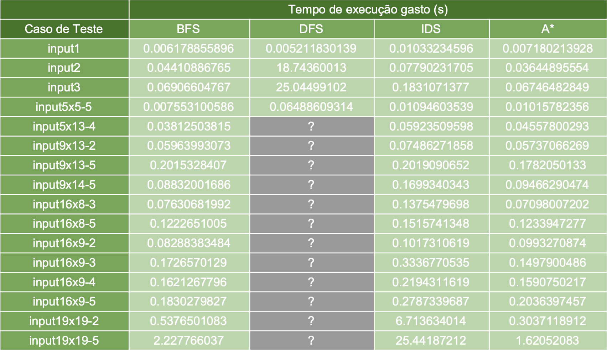
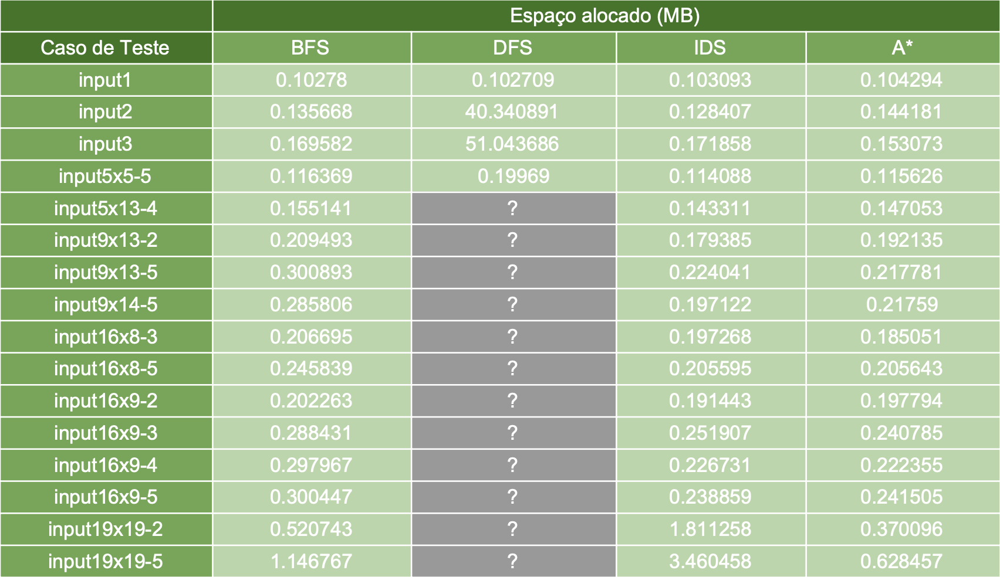
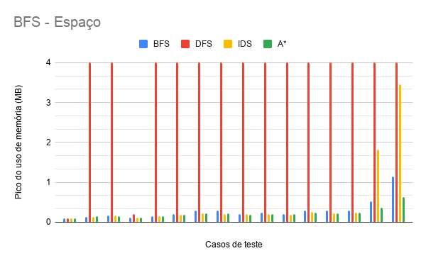

# Trabalho Prático 1 de Introdução à Inteligência Artificial

_Julia Tiemi Alkmim Morishita e Marcelo Luiz Harry Diniz Lemos_

### 1. Introdução

Esse trabalho consiste em ajudar Márcio, um administrador de sistemas a programar um AGV - _Automated Guided Vehicle_ - que percorrerá sua fábrica e coletará a produção. Cabe ao programa definir as rotas do veículo a partir de um mapa estático para reduzir custos. O trabalho consiste na implementação e comparação de quatro algoritmos de busca para encontrar o menor caminho entre o ponto inicial de cada instalação até o ponto de coleta: BFS (Busca em Largura), DFS (Busca em Profundidade), IDS (Busca com Aprofundamento Iterativo) e A\*.

### 2. Modelagem

A solução da tarefa envolve um agente que resolve o problema através de busca, chamado de _Problem-Solving Agent_. O objetivo do agente é um _goal_, ou seja um conjunto de estados, e ele busca uma sequência de ações para atingí-lo a partir do seu estado inicial.
Como visto na descrição do problema, o ambiente que o agente irá trabalhar é estático, observável, discreto e determinístico.
A implementação foi feita da seguinte maneira: primeiramente, buscamos e salvamos as informações da entrada (as dimensões e o valor de W e o mapa). A partir disso, foi gerado um grafo com o auxílio da biblioteca _graph-theory_. A peculiaridade desse grafo é que ele inclui apenas os pontos relevantes para a solução do problema, ou seja, os pontos de entrada, de abastecimento e o _goal_.
A partir do comando identificado na instrução de execução, ele segue a aplicar um dos quatro algoritmos no grafo.
Os estados do problema são todas as posições alcançáveis no mapa, ou seja, o conjunto de coordenadas que não estejam identificadas pelo símbolo de obstáculo \*. Além disso, excluímos os estados não alcançáveis devido à restrição pela necesidade do estado de abastecimento ('\#') após w passos, pois o veículo não pode trafegar até o local apesar dos comandos enviados.
Os estados iniciais definidos para cada mapa de dimensão x por y é dado pelo conjunto de coordenadas das laterais do mapa que não estejam identificadas pelo símbolo de obstáculo \*, ou:
[0, i], para todo 0 $\leq$ i $<$ x && [0, i] $\neq$ '\*'
$\cup$
[j, 0], para todo 0 $\leq$ j $<$ y && [j, 0] $\neq$ '\*'
$\cup$
[k, i], para todo 0 $\leq$ i $<$ x && k = y - 1 && [k, i] $\neq$ '\*' 
$\cup$
[j, l], para todo 0 $\leq$ j $<$ y && l = x - 1 && [j, l] $\neq$ '\*' 
As ações são as direções que o AGV pode andar, ou seja, baixo, cima, esquerda, direita.
O teste do objetivo consiste em saber se o veículo, depois de uma sequência de instruções, chegou até o _goal_, ou seja, a coordenada do mapa identificada por '\$'.
O custo de cada ação é 1.

### 3. Algoritmos

##### 3.1. BFS

O BFS é um algoritmo de busca sem informação completo, ou seja, através do estado inicial, das funções de transição e seus custos e o estado final, ele consegue encontrar a solução se ela existir. Ele consiste em expandir o nó mais raso que ainda não foi expandido. Em outras palavras, ele organiza os nós da fronteira em uma fila. Por esse motivo, não é necessário fazer a expansão antes de verificar se estamos no _goal_. Para o problema em questão, ele é ótimo, pois o custo para qualquer ação é 1. Para analisar a complexidade do algoritmo para a solução, vamos considerar o branch factor de 4 (pois temos quatro direções possíveis na maioria dos casos) e o nível da solução d: $O(4^{d})$. Em questão do espaço, ele também é exponencial, pois os nós precisam ser mantidos na memória.

##### 3.2. DFS

Assim como o BFS, o DFS é um algoritmo de busca sem informação. Porém, ao contrário do BFS, ele não consegue sempre encontrar a solução, pois ele falha em loops ou caminhos infinitos. Ele consiste em expandir o nó mais profundo, ou seja, ele organiza os nós da fronteira em uma pilha. O DFS não garante otimalidade, pois pela maneira que ele caminha, existe a possibilidade de expandir um _goal_ de custo maior e retorná-lo como solução. A grande vantagem d DFS está na complexidade de espaço, que é linear, pois ele armazena apenas a subárvore que ele está, ou seja, $O(4m)$, sendo m a profundidade máxima da árvore. Em questão de tempo, ele é exponencial, assim como o BFS, porém ao invés de considerar a profundidade da solução, ele considera a profundidade da árvore: $O(4^{m})$. Isso pode ser muito ruim se a profundidade da árvore for muito maior que a profundidade da solução.

##### 3.3. IDS

Esse algoritmo define um limite e várias buscas em profundidade dentro desse limite, aumentando-o a cada iteração. A vantagem dele é a combinação dos benefícios do BFS e do DFS: ele é completo e ótimo e com custo de memória linear. Pode ser considerado o melhor entre os algoritmos citados até agora.

##### 3.4. A*

Ao contrário dos algoritmos anteriores, o A\* é um algoritmo de busca com informação. Isso quer dizer que ele tenta utilizar alguma informação além da que está presente na formulação do problema para realizar a busca de forma mais eficiente. Para isso, ele usa uma função de avaliação $f(n)$ para cada nó, decidindo expandir o nó com menor $f(n)$. Em geral, $f(n)$ utiliza alguma heurística para guiar a ordem de expansão dos nós. A heurística para um nó n $h(n)$ é o custo estimado do nó até o _goal_. O algoritmo A\* é possivelmente o algoritmo de busca com informação mais rápido, que expande a menor quatidade de nós e garante a solução ótima (se utilizar uma heurística admissível, que será explicado a seguir). Ele consiste em escolher o nó a ser investigado considerando $f(n) = g(n) + f(n)$, no qual $g(n)$ é o custo real para chegar no nó em questão e $h(n)$ é o custo estimado para chegar ao _goal_. O A\* é completo e sua complexidade de tempo é exponencial, dependendo da solução (e não da profundidade), assim como sua complexidade de espaço, pois os nós são guardados na memória. 

### 4. Heurística - Distância de Manhattan

Para o algoritmo A\*, devido à natureza bimensional do mapa do problema, foi escolhida uma heurística chamada Distância de Manhattan. Ela consiste em calcular a soma dos comprimentos da projeção da linha que une dois pontos num espaço euclidiano com um sistema de coordenadas fixo. Por exemplo, para dois pontos $P1$ e $P2$ contidos em um plano com coordenadas $(x1, y1)$ e $(x2, y2)$, respectivamente, a Distância de Manhattan é definida por: $|x1 - x2| + |y1 - y2|$. Ela é uma heurística admissível, pois o custo indicado por ela é sempre menor ou igual ao custo real para o _goal_, uma vez que ela define a menor distância possível percorrendo em direções cima, baixo, direita, esquerda.

### 5. Análise dos Algoritmos

Com a ajuda das bibliotecas _time_ e _tracemalloc_, foi possível medir o tempo e espaço alocado durante a execução do programa para cada um dos casos de teste. A seguir vamos apresentar o resultado das execuções em formato de tabela e gráfico. Vale ressaltar que, para o DFS, não foi possível mensurar os resultados devido o elevado tempo de execução.

Primeiramente, a tabela e o gráfico relativos ao tempo. Qualquer valor do gráfico que alcança o topo do gráfico (2.5 segundos) é considerado maior que o limite deste. Na tabela, podemos ver os valores que foram observáveis. Para o DFS, temos alguns valores não encontrados, identificados com '?'. Todos esses valores são no mínimo de 10800 segundos.

Para o espaço, medido em MB, temos a mesma peculiaridade dos valores que atingem o limite do gráfico (4MB) serem maiores que isso. Os valores que foram observáveis estão na tabela relacionada.

Por fim, temos a tabela de número de nós visitados por cada algoritmo em cada caso de teste:

### 6. Discussão dos Resultados

Como podemos ver pelos resultados - ou pela falta deles - o DFS apresentou a pior performance entre os quatro algoritmos. Especialmente em questão de tempo, que foi o que limitou os testes. Ainda sobre tempo, o A* e o BFS tiveram tempos de execução bem similares. Em geral, o IDS gastou mais tempo que os dois.
Não foi possível enxergar a vantagem do DFS em relação ao espaço, devido à adapatação dele para sempre encontrar a solução ótima.
Sobre a quatidade de passos para cada algorítmo, foi nesse ponto que o algoritmo A*, uma busca com informação, mostrou-se valioso. É possível notar como ele expandiu uma menor quatidade de nós em relação aos outros três.